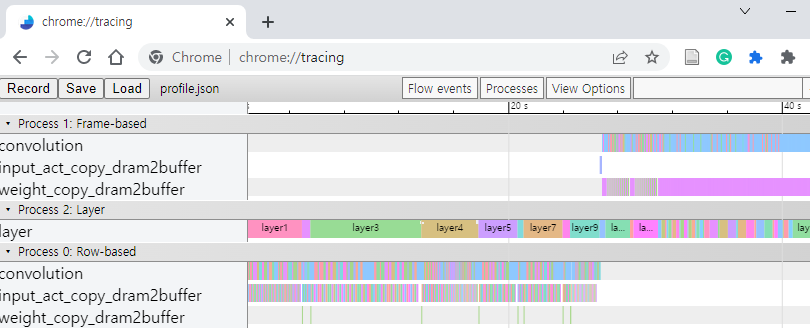

# sv_mon_logic
Simple monitoring logic to profile memory tarffic and utilizations

## Quick start with ModelSim
1. Get repository in your design directory
```
git clone https://github.com/ModestyJ/sv_mon_logic.git
```
2. Copy `tb_example.sv` contents to your <testbench_top_file>  

3. Add below files in a compilation step
```
vlog sv_mon_logic/sram_if.sv
vlog sv_mon_logic/utilization_if.sv
vlog sv_mon_logic/sv_mon_pkg.sv

vlog +define+PROFILE <testbench_top_file>
```

4. Elaborate the design
```
vopt +acc -o <top_design>
```

5. Load the design with `-permite_unmatched_virtual_intf` option
```
vsim -permit_unmatched_virtual_intf <top_design>
```

> **-permite_unmatched_virtual_intf** is only for ModelSim  
> No need to add any special option for Synopsys VCS and Cadence Xcelium

## How to integrate this in your design
* Add below files in the design compilation
```
sram_if.sv
utilization_if.sv
sv_mon_pkg.sv
```
* Instantiate inteface and connect them to the virtual interface in the monitor class. Refer to `tb_example.sv`. Please keep in mind that `import sv_mon_pkg::*;` must be added in your TB to use monitor classes.  
* Do simulation using RTL simulators such as xcelium, vcs and modelsim  
* Report files will be generated in the simulation time  
```
report/*.json
report/*.txt
```

## How to analyze report files
1. SRAM traffic report
* **\*.txt** files are generated by sram_mon class. Contents include read and write traffic, it may feed to a DRAM simulator.  
```
[RD]addr:0x33df6, data:0x808080008080800080808000808080
[WR]addr:0xb3d7c, data:0xf040508030907040014040200040504
[WR]addr:0xb3d7c, data:0x0
```

2. [Trace Event Foramt](https://docs.google.com/document/d/1CvAClvFfyA5R-PhYUmn5OOQtYMH4h6I0nSsKchNAySU/preview) inspired by [Pytorch profiler](https://pytorch.org/tutorials/recipes/recipes/profiler_recipe.html)
* **\*.json** files are generated by utilization_mon class. Contents include user specific event trace, it may feed to chrome browser.  
Open chrome browser and type below to address window  
chrome://tracing  
Load **\*.json**  


* **\*.json** files also can feed to `util/trace_parser.py` to calculate NPU utilization  

## Issues

### ModelSIM fatal error issue
Prameterized virtual interface does not match to actual interface
```
** Fatal: (vsim-8451) Virtual interface resolution cannot find a matching instance for 'virtual sram_sp_if #(.ADDR_WIDTH(22), .DATA_WIDTH(128))'.
```
It's possible the parameters used to declare a virtual interface type do not match the parameters of any instance of the actual interface.  
This is totally intentional behavior, because virtual interface could be **null** in case of actual interface is not connected.  
Because this is not syntax error, just ignore using below command to load design. (`-permit_unmatched_virtual_intf`)
```
vsim -permit_unmatched_virtual_intf <top_design>
```

### Trace Event Foramt(json) loading issue
_json_ format must be completeness as follows.  
```
{
  "traceEvents": [
    {"name": "dram", "cat": "mem_weight0", "ph": "X", "pid": 0, "tid": 3, "ts": 12255, "dur": 7660},
    {"name": "dram", "cat": "mem_weight1", "ph": "X", "pid": 0, "tid": 3, "ts": 13255, "dur": 5660}
  ]
}
```

If last part is not generated correctly, please check `is_last_layer` is connected to correct simulation end condition.  
